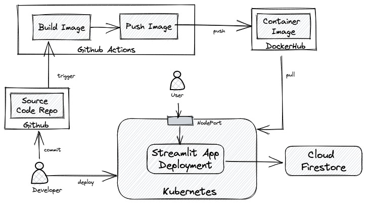
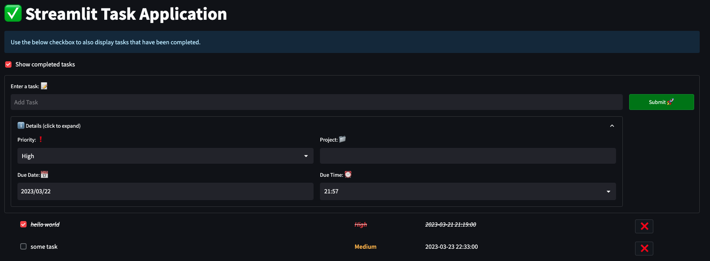

# Streamlit Task Application

This repository contains code for a simple Task management application. The main aim of this repo is to learn how to build an application using Streamlit and Firestore.

### Tech Stack

1. [Streamlit](https://streamlit.io/) is used to build the frontend UI and display basic visualizations.

2. [Firestore](https://firebase.google.com/products/firestore) is used as the primary database

3. [Docker](https://www.docker.com/) is used to containerize the application

4. [Kubernetes](https://kubernetes.io/) is used to deploy the application

5. [Plotly Express](https://plotly.com/python/plotly-express/) is used to display graphs


## Overview

This app allows a single user to create and complete tasks. The user can also see different visualizations to track progress.
The high-level deployment architecture is depicted below




## Prerequisites

To run this app, you'll need to have the following installed:

- [Python 3.9+](https://www.python.org/downloads/)
- Docker & Kubernetes (optional)
- Create a new firebase project by following the instructions [here](https://firebase.google.com/docs/admin/setup#initialize_the_sdk_in_non-google_environments)

## Running the app locally

If you would like to run the app locally without docker and kubernetes, you can do the following:

-  Clone this repository:

    ```bash 
    git clone git@github.com:ahmedmq/streamlit-task-app.git
    cd streamlit-task-app
    ```
   
- Define the following environment variables:

    ```bash
    export GOOGLE_APPLICATION_CREDENTIALS=<path to service account key>
    ```
  
- Install the requirements and run the streamlit app

    ```bash
    ./run.sh
    ```
The above command should open a browser window and access the app running on http://localhost:8501

## Running the app on Docker

Alternatively if you want to build a docker image and run the app in a container, you can do the following:

  - Build the docker image:

    ```bash
    docker build -t streamlit-task-app .
    ```
   
  - Define the following environment variables:

    ```bash
    export GOOGLE_APPLICATION_CREDENTIALS=<path to service account key> 
    ```


  - Run the docker container by injecting the credentials and configuration from your local system into the local container:

      ```bash
      docker run -p 8501:8501 \ 
        -v $GOOGLE_APPLICATION_CREDENTIALS:/tmp/keys/keys.json:ro \
        -e GOOGLE_APPLICATION_CREDENTIALS=/tmp/keys/keys.json \
        streamlit-task-app
    ```
  
Open a browser window and access the app running on http://localhost:8501

## Deploying the app to Kubernetes

Once you have built the container image in the previous step, use the following steps to deploy the app to Kubernetes:

  - Define the following environment variables:

    ```bash
    export GOOGLE_APPLICATION_CREDENTIALS=<path to service account key> 
    ```

  - Generate a base64 encoded value of your service account key file. You can use the following command to generate the base64 encoded value:

    ```bash
    cat $GOOGLE_APPLICATION_CREDENTIALS | base64
    ```
  - Modify the secret value `cred_json_file` in  [k8s/secret.yaml](k8s/secret.yaml) with the base64 encoded value got from the previous step.

  - Push the container image to your Docker hub registry. You can use the following command to push the image to your docker hub registry:

    ```bash
    docker tag streamlit-task-app <dockerhub_username>/streamlit-task-app
    docker push <dockerhub_username>/streamlit-task-app
    ```

  - Modify the image name in [k8s/deployment.yaml](k8s/deployment.yaml) with the name of the image that is pushed to your docker hub registry.  


- Run the following command to deploy the app to Kubernetes:

    ```bash
    kubectl apply -f k8s/
    ```

- Access the app by navigating to the following URL:

    ```browser
    http://localhost:30080
    ```

## GitHub Actions

This repository contains a GitHub action [workflow](.github/workflows/github-ci.yml) that builds and pushes the docker image to Docker Hub Registry. The workflow is triggered on every push to the main branch. 

After you have forked this repository, you can use the workflow as is. You will need to add the DOCKERHUB_USERNAME and DOCKER_HUB_TOKEN secrets in the action settings to provide your docker hub username and password respectively.

## Application Screenshots

- Simple Form to create a new task and display the list of tasks:

    

- One of the visualisation is a Gantt Chart to track progress:

    

  The above graph is generated by using Fake data. The data is generated using the [Faker](https://faker.readthedocs.io/en/master/) library.